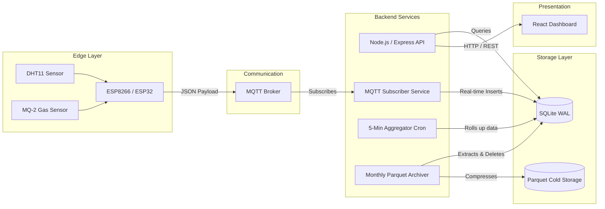

# IoT Telemetry & Environmental Monitoring Platform

## Executive Summary

An end-to-end IoT platform designed to collect, process, and visualize high-frequency environmental telemetry (temperature, humidity, and gas concentration) in real time. The system enables reliable edge-node data ingestion via MQTT, efficient local storage with automated roll-ups, and a responsive frontend for monitoring equipment or environmental health, reducing downtime and improving operational visibility.

## 🚀Key Features

* **High-Throughput Telemetry Ingestion:** Non-blocking MQTT subscriber capable of handling high-frequency sensor payloads.
* **Resilient Edge Connectivity:** Automated WiFi-loss detection with a localized fallback configuration portal.
* **Stream-Optimized Data Export:** Memory-safe API for exporting millions of rows into compressed CSV archives without blocking the Node.js event loop.
* **Automated Data Roll-ups:** Background chron tasks that aggregate granular 5-second interval data into 5-minute averages for fast historical querying.
* **Cold Storage Archiving:** Standalone data lifecycle management that compresses aged SQLite data into column-oriented Parquet files.
* **Remote Device Management:** Command and control API to remotely trigger diagnostics or open/close device configuration portals.

## 🏗️System Architecture

The architecture is built to isolate high-velocity ingestion from client-facing read operations.



### Layer Breakdown

* **Device Layer:** ESP microcontrollers polling physical sensors, performing local calibration (e.g., MQ-2 R0 calculation), and publishing serialized JSON payloads.
* **Communication Layer:** MQTT broker serving as the decoupled ingestion point.
* **Processing Layer:** Node.js backend managing both the MQTT subscription (write pipeline) and the REST Express server (read pipeline).
* **Storage Layer:** A heavily optimized SQLite database for active data, alongside a filesystem-based Parquet archive for historical records.
* **Presentation Layer:** A Vite/React frontend utilizing Tailwind CSS and Recharts for data visualization.

## 💻Technology Stack

**Embedded:**

* C++ / Arduino Framework
* ESP8266 & ESP32
* WiFiManager & MQTT Client

**Backend:**

* Node.js & Express.js
* MQTT.js
* better-sqlite3

**Database & Storage:**

* SQLite3
* Apache Parquet (via parquetjs-lite)

**Frontend:**

* React 19 & TypeScript
* Vite & Tailwind CSS 4
* Recharts

**Infrastructure:**

* Docker & Docker Compose
* Linux

## 📊Engineering Challenges & Solutions

### 1. Managing High-Velocity Data in a Standard Database

**Challenge:** The practical challenges of managing high-velocity, real-time data from IoT devices often lead to database locking, especially when heavy historical reads conflict with continuous batch insertions.
**Solution:** Enabled SQLite's Write-Ahead Logging (WAL) mode and `synchronous = NORMAL` pragmas. This allows concurrent readers and writers. Furthermore, implemented a data aggregation pipeline (5-minute roll-ups) to summarize the raw high-frequency data. Dashboards query the aggregated tables rather than the raw data, drastically reducing latency and I/O overhead.

### 2. Edge Network Resiliency

**Challenge:** Edge devices deployed in environments with unstable networking often fall offline and require manual physical resets to update credentials.
**Solution:** Developed a state-aware WiFi tracking mechanism in the firmware. If the WiFi connection is lost for more than 2 minutes, the ESP device automatically switches to `WIFI_AP_STA` mode and spins up a local captive portal. Once the connection is restored, the portal is automatically torn down to conserve memory and power.

### 3. V8 Event Loop Blocking on Large Data Exports

**Challenge:** Exporting 7-day raw telemetry logs for multiple devices caused memory spikes and blocked the single-threaded Node.js event loop, degrading the real-time API.
**Solution:** Transitioned the export API to a pure stream-based architecture. Data is queried via database cursors and piped directly into a compression stream (ZIP/CSV) on the HTTP response object, keeping RAM usage strictly under the 256MB Docker container limit.

## Design Decisions

### Why MQTT?

MQTT was selected over HTTP for the device layer because its lightweight publish-subscribe model is highly optimized for low-bandwidth IoT environments and significantly reduces packet overhead on the microcontrollers.

### Why SQLite with WAL?

While a heavy RDBMS (like PostgreSQL) is standard for backend systems, SQLite was chosen to minimize operational complexity and deployment overhead. By enabling WAL mode and isolating long-term storage, SQLite easily handles the required concurrency and throughput without the need for a separate database server.

### Why Parquet for Cold Storage?

Historical telemetry is rarely queried but must be retained. Storing years of raw data in SQLite leads to severe file bloat. Apache Parquet is a column-oriented data format that achieves massive compression ratios on repetitive time-series data. The monthly archiver seamlessly moves old data into Parquet, ensuring the active database remains fast and lean.

## 📂Repository Structure

```text
├── backend/
│   ├── src/
│   │   ├── api/         # Express routes (Export, Devices, Health)
│   │   ├── db/          # SQLite initialization, queries, and WAL pragmas
│   │   ├── mqtt/        # MQTT client, publisher, and subscriber pipelines
│   │   ├── parser/      # Sensor payload sanitization
│   │   └── scripts/     # Monthly Parquet archiving logic
│   ├── data/            # Persisted SQLite volume
│   ├── Dockerfile       # Multi-stage build (prod & dev modes)
│   └── package.json
├── frontend/
│   ├── src/
│   │   ├── components/  # Reusable UI (SensorCard, Charts)
│   │   ├── hooks/       # Custom React query hooks
│   │   ├── pages/       # Dashboard and routing views
│   │   └── utils/       # API clients and formatting
│   ├── Dockerfile       # Multi-stage build (prod & dev modes)
│   └── package.json
├── nginx/
│   └── nginx.conf       # Reverse proxy config (gzip, caching, API routing)
├── PlatformIO/
│   ├── src/
│   │   └── main.cpp     # ESP device firmware
│   └── platformio.ini   # Build configurations and library deps
├── docker-compose.yaml  # Production orchestration (nginx + backend)
└── docker-compose.dev.yaml  # Development orchestration (hot-reload)
```

## 🐳Deployment & Docker

The project uses containerized deployment with separate configurations for development and production:

### Production Deployment
```bash
docker-compose up
```
- **Backend:** Runs on port 3000 with production-optimized multi-stage build
- **Frontend:** Served by nginx on port 80 with gzip compression and static asset caching
- **Reverse Proxy:** nginx proxies `/api/*` requests to the backend service
- **Resource Limits:** Memory capped at 256MB (backend) and 128MB (frontend)

### Development Deployment
```bash
docker-compose -f docker-compose.dev.yaml up
```
- **Backend:** Runs on port 3000 with nodemon for hot-reload on code changes
- **Frontend:** Runs Vite dev server on port 5173 with HMR enabled
- **Volume Mounts:** Source code mounted for live reload during development
- **No Resource Limits:** Easier debugging and faster iteration

### Dockerfile Strategy
Both `backend/Dockerfile` and `frontend/Dockerfile` use multi-stage builds with build arguments:
- `BUILD_MODE=prod` — optimized production image with minimal footprint
- `BUILD_MODE=dev` — includes development tools (nodemon, source maps)

### nginx Configuration
Located at `nginx/nginx.conf`:
- **Gzip Compression:** Reduces response sizes for text/CSS/JS/JSON
- **Static Asset Caching:** Sets 1-year cache headers for immutable assets
- **SPA Fallback:** Routes all unknown paths to `index.html` for React Router
- **API Proxy:** Forwards `/api/*` requests to backend service on internal network
├── docker-compose.yaml
└── README.md

```

## ⚙️Installation & Deployment

### Prerequisites

* Docker and Docker Compose
* An accessible MQTT Broker

### Setup

#### 1. **Clone & Configure:**
```bash
git clone https://github.com/yourusername/iot-telemetry-platform.git
cd iot-telemetry-platform
cp backend/.env.example backend/.env

```


*Edit `.env` to include your MQTT broker credentials and set `API_BIND_ADDR=0.0.0.0`.*
#### 2. **Prepare Volumes:**
Ensure persistence directories exist:
```bash
mkdir -p backend/data backend/parquet

```


#### 3. **Deploy:**
```bash
docker-compose up -d --build

```


#### 4. **Verify Health:**
```bash
curl http://localhost:3000/health
docker-compose logs -f backend

```


## ⏫Performance & Scalability

The system is tuned for resource-constrained environments. The Node.js Docker container is hard-capped at 256MB of RAM. The architecture scales on the time axis rather than the hardware axis: by aggressively rolling up data into 5-minute chunks and archiving raw payloads into cold storage on a monthly cron schedule, the primary operational database never exceeds a predictable size, guaranteeing flat latency curves over years of uptime.

## Future Improvements

* **Edge AI Inference:** Integrating lightweight deep learning models (like optimized CNNs) directly on the ESP/Raspberry Pi edge nodes to detect gas concentration anomalies locally, reducing the reliance on cloud thresholding.
* **Over-The-Air (OTA) Updates:** Implementing an OTA pipeline to securely flash updated firmware to remote fleets.
* **Multi-tenant Support:** Architecting the backend to support role-based access control and multiple organizational silos.

## Lessons Learned

* **Telemetry Pipeline Stability:** Implementing robust, single-attempt non-blocking MQTT reconnection logic is vital; aggressive reconnection loops in C++ can easily trigger hardware watchdogs.
* **Resource Tradeoffs:** Shifting the burden of data archiving from an active query process to a background, standalone script successfully decoupled system maintenance from API performance.
